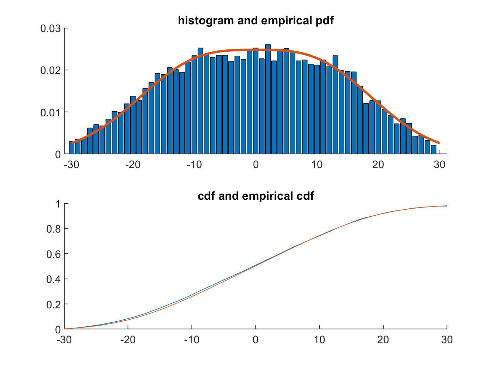
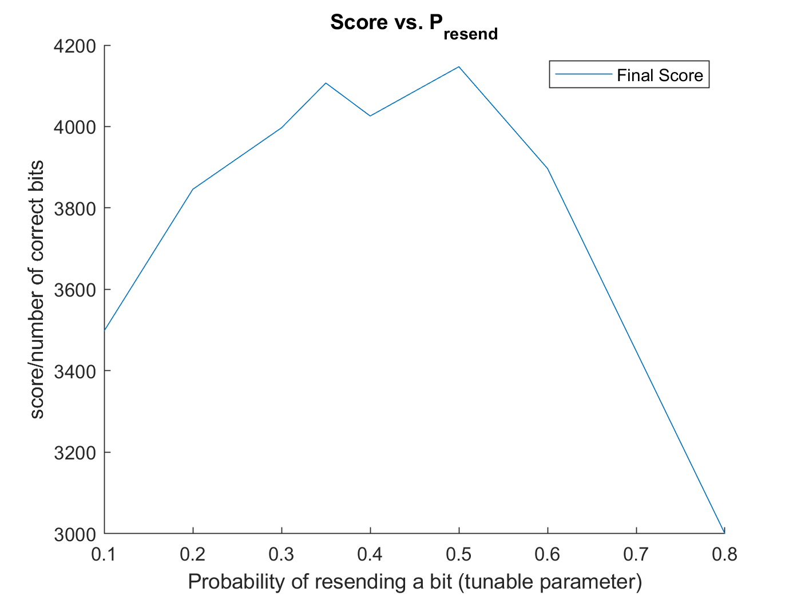
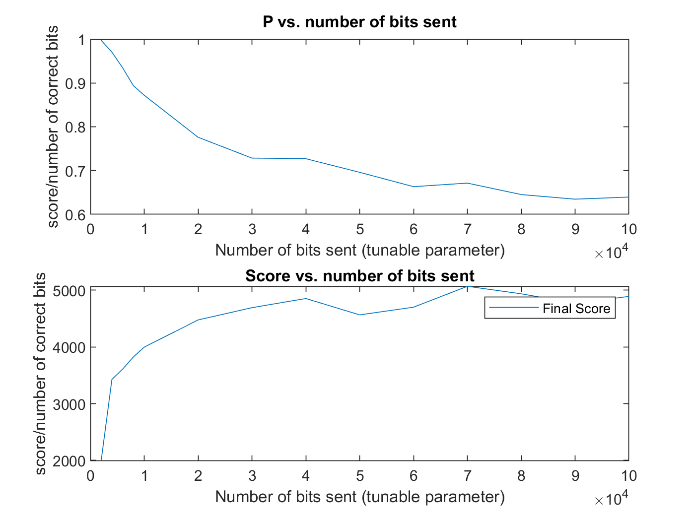
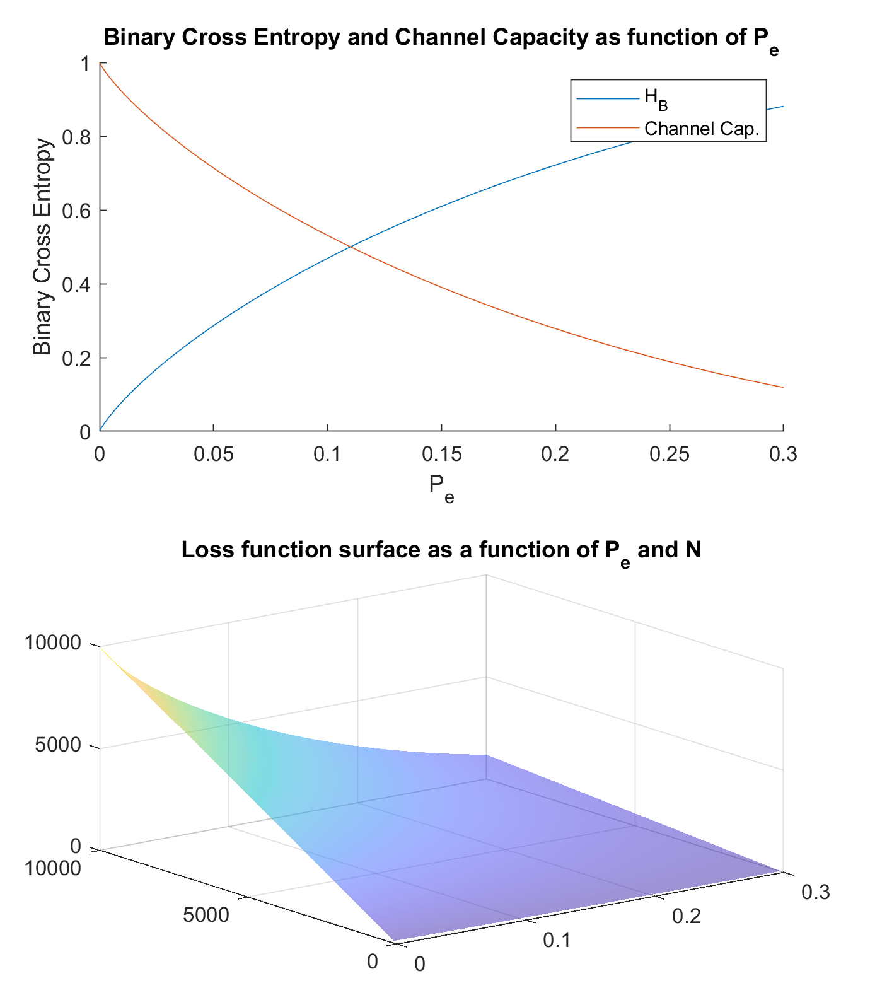
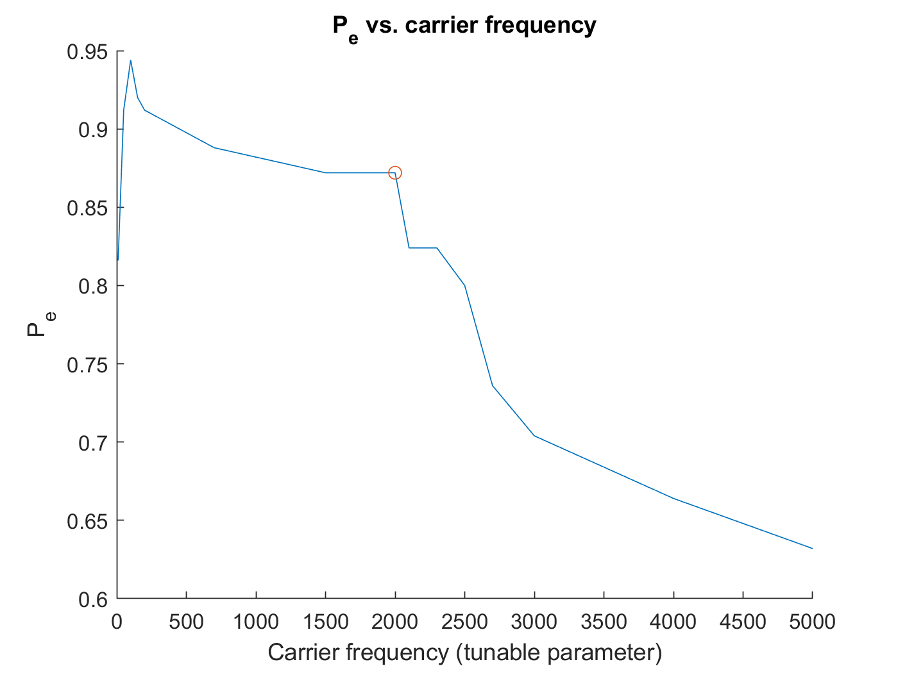

# ENGN1580-final-spectrum-challenge
Final Project for ENGN1580  

## Folder Structure
All code lives under `Code` folder. Under `Code`, we have scheme\_#\_<description>\_<author>. They are identical copies of the entire standalone program. They are different strategies we have developed. For your own work, starta a new folder under Code. You can build upon previous work by copying over another teammate's folder.  

## Modulation schemes (refers to yiheng's schemes only)
Scheme 1: ASK, one rail. Sin and Cos functions at given freq.  
Scheme 2: CDMA-like (Baseband), carriers (chips/codewords) are simply +1 and -1.  
Scheme 3: CDMA-like (Baseband), with channel noise modeling, adaptive Ack/Nack, and adaptive energy use  
Scheme 4: cheating, by saving msg to disk and reading from disk   
Scheme 5: QPSK, with up to 16 signal points

### A Note on file structure
1. In each scheme's folder, we have a `constants.m` which greately facilitated parameter tuning and experimentation. Both sender and receiver imports this file so that we are certian that they are operating with the same set of parameters such as bit interval, modulation scheme, Ack/Nack thresholds, etc.
2. In each scheme's folder, we have a `modulation_scheme.m` in which we separated out the carrier functions. This also made sure that sender and receiver have the same set of carriers.

# Detailed explanations (refers to yiheng's schemes only)
In the following section, we introduce each scheme one by one, and the new features we introduced in that scheme. Generally, the later schemes build on top of the work of previous schemee, simply by adding new features to make the code more robust. The most **important ideas** are bolded below.
## Scheme 1 ASK
This is this most basic version. Not too different from Alberto's stencil.

#### Features
1. Centered signal constellation: The first thing we did was to center our signal set to maximize energy use.

2. **Adaptive energy use**:  Since we normalize all of our carriers in this repo, we can easily anticipate the total energy we use. We can therefore calculate amplitude of our carrier based on the given energy budget. This makes sure that we use all of our energy, no more and no less. We set a `safety_threshold=0.95` so that we use 95% of the energy budget to be safe.  

Observation: We noticed that as long as we change amplitude/energy with respect to bit_interval, neither bit_interval nor ampltude really affects the final score. In other words, we can transmit as fast as possible (by having small bit_interval but high power use--fast and hard) or we can transmit as slow as possible (long bit interval and low power--slow and steady).

#### Parameter tuning
`bit_interval = 2`: Carrier period. The shorter, the higher amplitude of our carriers (which decreases P_e), but shorter bit interval (which increases P_e)  
`amplitude = 7.04`: scaled based on bit_interval to ensure we meet the power budget.  
`total bits to send = 10000`: the more number of bits we send, the higher N is in our score, but also the higher P_e.    
`carriers frequency = 1000`: carrier frequencies for both sin and cos.  

## Scheme 2 CDMA-like (Baseband)
Our carriers are simply positive and negative 1 times amplitude.

#### Features
1. **Burst communication** with pseudo-random silent periods: We divide the total bits to send into several packets (bursts) to send. The silence period is a preset interval (calcualted based on `loop_max`) pluse random offset.

#### Parameter tuning
`bit_interval = 1`  
`total_num_packets = 8`: How many packets we divide the total bitstream into. Shouldn't really affect anything. But creates more resilience to randomness in the arena.  
All other parameters are the same as Scheme 1

## Scheme 3 CDMA-like (Baseband) with adaptive Ack/Nack (BEST SCORE)

#### Features
1. Channel noise modeling: During the silence period, we model the channel as a **Gaussian random variable**. We calculate the noise's standard deviaion and mean for Ack/Nack and energy calculations.

2. Ack/Nack: Assuming that the noise is additive, zero-mean, Gaussian white, we can model the decision process as a **Bayes' classifer**. We calcualted for empriical distribution and pdf, as well as empirical cdf and true cdf (for one specific set of parameters, just to show the process) shown below. See figures below or see interactive graph by running `Code/research_code/research_code_yiheng.mlx`.  

  

Under this assumption, we set a threshold, symmetric and centered at origin, such that if the correlator output lands in this threshold, we resend the bit. Since we know the mean and std of noise, we can (relatively safely) calculate the probablity of resending a bit, assuming that the noise profile will remain the same during our short bust, as it was during the silent interval. A more sophisticated algorithm will use a weighted mean/std estimation by putting heavier weights to the channel samples closer to our burst communication (i.e. the noise profile a long time ago is less relevant).

Now, knowing the probabiltiy of resending a bit, the total number of sends can be modelled as a **Geometric random variable**, and the expeted numebr of sends is simply `N * 1/P_resend`.

Note: In reality, we fix `P_resend` as the tunable parameter, and calculate the interval and carrier amplitude from `P_resend` instead. This allows us to have a much easier and intuitive parameter tuning process (see section Parameter Tuning below).

3. Adaptive energy use with Ack/Nack: Based on the channel noise profile (mean and std), we dynamically adjust the following constants after each silent interval: `amplitude`, `resend_threshold` while keeping the tunable parameter--probability of resend `P_resend`--consant.

Explanation on the perfect feedback channel (uselessness of receiver channel): We exploited the fact that both sender and receiver have access to the identical copies of both channels. Hence, there is no information that receiver has that sender does not. This means that the sender cannot gain any **information** from the receiver (here we use the adult definition of information) by utilizing the receiver channel. Scrictly speaking, the only information receiver has that sender does not have is initla_e_rec, but since we are not using receiver channel, this information is useless.

#### Parameter tuning
1. `P_resend = 0.35;`: The probability of resending a bit. The higher, the more likely we resend a bit (which lowers P_e), but lower the carrier amplitude as well since we have limited power budget (which increases P_e). See figures below or see interactive graph by running `Code/research_code/research_code_yiheng.mlx`.  

  

2. `total bits to send = 70000`: Given a specific energy budget, find the balance between bits to send (N in the final score) and accuracy (cross entropy). We empirically found that the maximum score is achieved by sending 70000 bits as shown in figure below. In other words, if we consider the final result as the loss function, and given the constraints, we can climb to the achievable highest point on the surface when `N = 70000`. See figures below or see interactive graph by running `Code/research_code/research_code_yiheng.mlx`.  

All other parameters are the same as Scheme 1

  
  

## Scheme 4 Cheat
A simle script (with some code obfuscation just to make Alberto's life harder) that saves msg file to disk and reads it to return.

## Scheme 5 QPSK, a constellation of up to 16 signal points
This is the final research direction we took. It did not yield the best results, but had solid performance. We couldn't finish all parameter tuning nor implement ACK/NACK with this scheme, both of which would increse performance. Adaptive frequency hopping is another direction to take.

#### Features
1. Signal constellation: we determined the valid frequency range we can use and built a signal constellation of 16 signal points on 8 orthogonal rails (8-dimensional signal space). We divided the dimensions in frequency (although in our current scheme, the frequencies are not orthogonal!)  

We can therefore encode up to 4-bit at a time into one signal point, which theoretically reduces the energy use 4-fold.

#### Parameter tuning
1. Determining **valid frequency range**: we empirically determined the valid frequency range by simply using only one of the rails and changing the frequency to observe `P_e`. We determined that 100-2000Hz to be a good frequency range. See figures below or see interactive graph by running `Code/research_code/research_code_yiheng.mlx`.  

  

